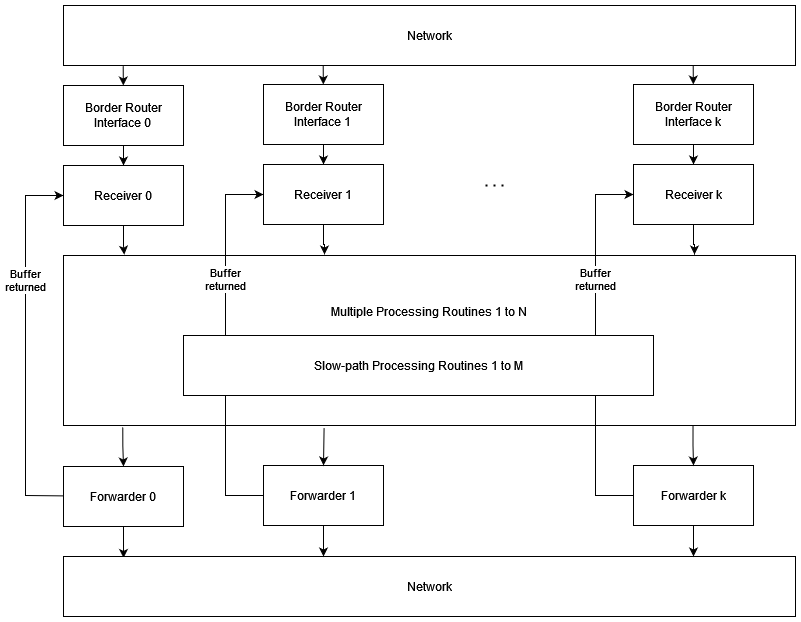

# Border Router Redesign
* Author: Justin Rohrer
* Last Updated: 2023-04-12
* Status: In Review
* Discussion at: [#4334](https://github.com/scionproto/scion/issues/4334)
* Implemented in: 

# Motivation
Right now, the performance of the border router is strongly limited because a single goroutine per
border router interface is responsible for reading, parsing, processing and forwarding the packets.
Redesigning this pipeline will lead to significant performance improvements.
The current design was not created with performance in mind and hence, the performance has to be improved.
Once there also existed a design which did something similar to the posposed design in this document.

# Overview
The pipeline gets changed to have seperate goroutines for the receiving, processing and forwarding steps.
This will lead to a much higher performance because the expensive processing logic is moved to other
goroutines and to improve the performance we can just increase the number of processing routines.

# Design
The border router will consist of three layers, the receiving, the processing and the forwarding.
The communication between those layers and its components are implemented as go channels.

* **Receivers** There is one receiver per border router interface that is responsible for batch-reading the
packets from the network socket, identify the source and flowID and use them to identify which processing
routine has to process the packet and enqueues it.
If the queue of that processing routine is full, the packet will be dropped.
Each receiver has a pool of preallocated buffer that they can use to store the packets they receive.
This can be implemented as a queue of byte slices where the receiver reads a certain amount of byte slices,
updates the pointers of the ipv4.Message.Buffers and then performs a batch read.
* **Processing Routines** There are several processing routines and slow-path processing routines
in the border router that are responsible for processing the packet.
The actual processing logic remains unchanged.
If the processing routine identifies a packet that belongs to the slow-path, the processing routines enqueues
the packet to a slow-path processing routine. If the queue of the slow-path processing routine is full, the
packet will not be processed at all. In this case the buffer is immediately returned to the receiver.
Once a packet is processed, it gets enqueued to the forwarder which is responsible for the egress interface.
If the queue of the forwarder is full, the packet will be dropped.
* **Forwarders** There exists one forwarder per border router interface that is responsible for forwarding the
packets over the network that it receives from the processing routines. It forwards the packets as a batch.
Afterwards it returns each buffer to the receiver from which it originates.

## Mapping of processing routines
To prevent any packet reordering on the fast-path, we map the tuple of source and flowID, see the
[SCION header documentation](https://github.com/scionproto/scion/blob/master/doc/protocols/scion-header.rst),
to a fixed processing routine using a hash function together with a salt value to prevent pre-computations
of the exact mapping.

## Slow path
During processing, packets that have to follow the slow path are identified and forwarded to the
slow-path processing routines.
Rate limiting of slow-path operations is not implemented explicitly, but only implictily through specifying
the number of slow-path processing routines in the configuration.
In case a packet is identified to belong to the slow path but the queue of the slow path is full, the
packet is dropped.
Packets currently identified for slow-path are:
* Malformed packets
* SCMP traceroute packets

# Configuration
The configuration of the border router will remain in the border router toml file.
The following configuration entries are added:

## Pool size of packet buffers
Since a pool of packet buffers is bound to a receiver, the size of the pool can be configured for each
receiver seperately.
It makes sense to make this configurable on a per border router interface level because not every 
interface might have the same expected load and hence not every interface requires the same pool size.
An appropriate default value would have to be evaluated.

## Number of processing routines (N)
By configuring the number of processing routines one can specify the number of goroutines that are able
to process packets in parallel.
A default value could be 4 to 8 times the number of border router interfaces.

## Number of slow-path processing routines (M)
By configuring the number of slow-path processing routines one can specify the number of goroutines that
process the packets on the slow-path.
A default value could be the same number as we have border router interfaces.

## Processing packets channel size
Since each processing routine has a queue of packets to process and all packets not fitting in the queue
are dropped, one has to specify a reasonable queue size.
A default value could be 256.

# Considerations for future work
## Multiple Receivers per Border Router interface
We could deploy multiple packet receivers per border router interface and use eBPF to make sure that all
packets that belong to the same flow are received by the same receiver.
Because the rest remains unchanged we would still have the "no-reordering" guarantee and significantly
increase the read speed.

## Lock goroutines to threads
The CPU affiliation by locking the goroutines to threads and CPU cores can later be studied and would become
much easier by applying this design because we have more goroutines and hence more flexibility how we want to fix
them to the cores.

## Replace go channels with custom ring buffer
In the future we might want to replace the go channels that are used for communicating between the goroutines
with custom ring buffers in case this provides higher performance.

## Traffic engineering
With the implementation as described in this document the forwarders process the packets in the order they are enqueued.
In the future we can use additional queues for prioritized traffic between the processing routines and the forwarders.
See [PR 4054](https://github.com/scionproto/scion/pull/4054).

## UDP generic segment offloading (GSO)
In the future we could add UDP generic segment offloading (GSO) for the connections between border router
of different ASes to improve the performance even more.
Such an implementation would be feasible in the future because we would just have to identify identify
which border router interfaces are affected and for them make some changes to the IO parts.

# Implementation steps
* Restructure the router/dataplane.go file to have a reading, processing and forwarding functionality
* Add buffer reusal support
* Add slow-path support