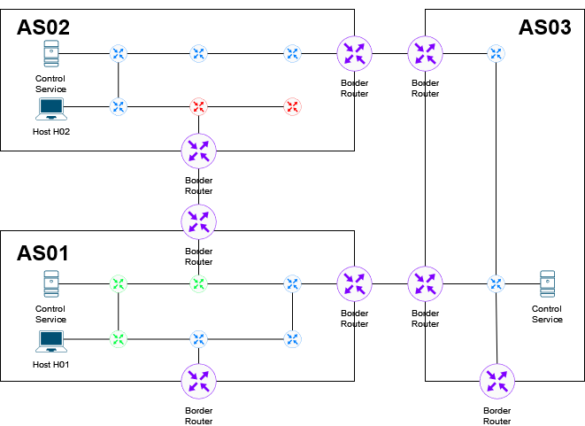
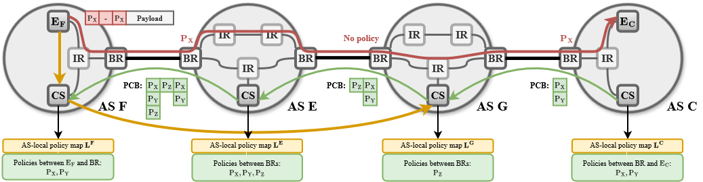
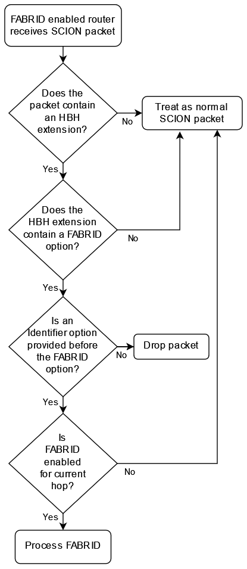

********
FABRID
********
.. _fabrid-design:

- **Author**: Justin Rohrer, Jelte van Bommel, Marc Odermatt, Marc Wyss, Cyrill Krähenbühl, Juan A. García-Pardo
- **Last updated**: 2024-05-06
- **Discussion at**: -

Abstract
===========

In SCION, endhosts have the option to choose *inter-AS* paths to forward packets to their desired destination.
However, some applications require more fine-grained path selection like "Do not route traffic over devices
produced by hardware manufacturer X or that run software Y with version < Z" which requires transparency and
control also with respect to *intra-AS* paths.
Such fine-grained path selection is useful for example if there exists a known bug in certain router versions that affect secure communication,
or if an entity simply does not trust a certain hardware manufacturer, so that traffic can be steered around those devices.
This can also be seen as an enhancement for keeping traffic within a certain jurisdiction, e.g., by routing traffic
only along devices located in a specific country, because a single AS could cover multiple countries.

    
    Example network topology.
    Different colors for intra-AS routers indicate different manufacturers.
    H01 in AS01 and H02 in AS02 want to communicate with each other.
    This topology allows constraints like "Do not route traffic over devices produced by hardware manufacturer red", or
    "Route traffic only over devices produced by hardware manufacturer green or blue".
    Note that, since all paths between Host H01 and Host H02 traverse a green router, it is not possible to find a path that does not traverse green routers.

Background
===========

The `FABRID <https://netsec.ethz.ch/publications/papers/2023_usenix_fabrid.pdf>`_,
protocol allows to implement such fine-grained path selection.
A deployment of FABRID in SCIONLab makes its next-generation features available to interested parties around the globe.
FABRID also implicitly implements the `EPIC' <https://netsec.ethz.ch/publications/papers/Legner_Usenix2020_EPIC.pdf>`_
features, including source authentication for routers and the destination host, and path validation for source and destination hosts.

Proposal
========

FABRID indroduces policies, which can be thought of as additional path constraints: ASes on an endhost's selected inter-domain path only
forward traffic over intra-AS paths of their network that match the endhost's selected policy.
ASes announce the policies they satisfy to endhosts, which use them during path selection to further constrain the desired forwarding paths.
The endhosts communicate the selected policies to the on-path ASes by encoding them in SCION data packets.
On-path border routers read the encoded policies from each packet, and forward the packet along one of potentially multiple policy-compliant intra-AS paths.
Enforcing correct traversal of an intra-AS path can for example be achieved through MPLS.
Some FABRID policies are globally defined and others locally per AS.
Global policies serve the purpose of avoiding redundancy for policies implemented by many ASes.
The AS network operator specifies in a configuration which global policies are supported, and can additionally define arbitrary local policies.
Since each AS can create their own local policies, endhosts need a mechanism to discover them.
We distinguish between policy identifier and policy description.
The policy identifiers are provided to the endhosts as a detachable PCB extension.
The policy descriptions on the other hand have to be requested from the local control service which will then either return
the cached policy description or query the policy description from the remote AS.
By only encoding the policy identifiers, but not the policy descriptions, inside the PCBs, we can minimize FABRID's PCB size overhead, which thus becomes negligible.
In our design, endhosts retrieve the policies from their local AS, and the local AS retrieves them from the remote AS, similar to how SCION path retrieval is implemented.
Those policies are only fetched on demand by the local control service and will be cached until they expire.
This on-demand policy retrieval improves the scalability of the control service compared to simply fetching all the policies from all ASes in the internet.
A source endhost can then select a SCION forwarding path, where it encodes up to one policy index for each on-path AS (it can also select no policy for an AS) in its packets.
On-path border routers will then add a proof of transit such that the destination endhost can later verify that the packet indeed followed the intended path.

    Policy-driven intra-AS Routing with FABRID. During beaconing, every AS adds its supported policies to the PCB (green). Endpoint :math:`E_F` fetches the
    corresponding path including the added policies from its control service, which resolves and caches unknown policies (orange).
    For packets destined to :math:`E_C`, :math:`E_F` encodes its policy choice :math:`P_X` in the respective headers, except for AS G, which does not support
    this policy, and AS F, which supports the policy by default (red). Although not all ASes support :math:`P_X`, :math:`E_F` still decides to send its
    traffic over the path.

Our proposed design and implementation of FABRID allows for incremental deployment at router- and AS-level, i.e., some AS operators may want to
deploy FABRID while others do not, and those who do may only want to deploy it on a subset of border routers.
This allows for a smooth migration, during wich an AS can test-wise update some border routers and verify that everything works as intended.
However, allowing for incremental deployment can lead to the situation in which an endhost may not have any forwarding path available for which every on-path AS supports FABRID.
In such a situation, the endhost's traffic is still forwarded along that inter-domain path, but FABRID's intra-domain forwarding guarantees only apply to the FABRID-enabled ASes.

The design document specifies:

- The header design
    Specifies the two new Hop-by-Hop extension options, including definitions of their option fields.
- Modifications of the data plane
    Describes the packet generation process at endhosts, the forwarding process at border routers,
    and the path valildation procedure at the destination endhost.
- Modifications of the control plane
    Describes the format of FABRID policies, the modifications to the path construction beacons,
    and the FABRID control service endpoints used to communicate policies to endhosts and other ASes.
- Configuration
    Describes how the border router and the control service have to be configured such that they are able to process FABRID packets,
    how the FABRID policies can be configured, and how the MPLS labels can be set for a pair of connection points (interface to interface or interface to IP range).
- Rationale
    Describes different design options and the reasoning behind the decision behind our choice.
- Implementation
    Lists the steps in which FABRID is going to be implemented.

The design document will be extended in the future to also specify features that will be implemented in a later
iteration e.g. when adding path validation also for the source endhost.

Header design
--------------

The FABRID header design is based on SCION Hop-by-Hop extensions (HBH), in order to allow for incremental deployability.
We define two options, the Identifier option and the FABRID option.
The Identifier option contains the packet ID and a timestamp, which are used to uniquely identify a packet.
The FABRID option contains the FABRID hopfield metadata fields and a path validator field.
The Identifier option can be used without the FABRID option and can therefore also be used by other extensions.
The FABRID option on the other hand requires that the Identifier option is specified in the HBH extension before the FABRID option.

.. _identifier-option:

Identifier Option
^^^^^^^^^^^^^^^^^^

The Identifier Option always has a length of 8 bytes and looks like:

.. code-block::

     0                   1                   2                   3
     0 1 2 3 4 5 6 7 8 9 0 1 2 3 4 5 6 7 8 9 0 1 2 3 4 5 6 7 8 9 0 1
                                    +-+-+-+-+-+-+-+-+-+-+-+-+-+-+-+-+
                                    |  OptType = 3  |  OptLen = 8   |
    +-+-+-+-+-+-+-+-+-+-+-+-+-+-+-+-+-+-+-+-+-+-+-+-+-+-+-+-+-+-+-+-+
    |R R R R R|                Timestamp                            |
    +-+-+-+-+-+-+-+-+-+-+-+-+-+-+-+-+-+-+-+-+-+-+-+-+-+-+-+-+-+-+-+-+
    |                          Packet ID                            |
    +-+-+-+-+-+-+-+-+-+-+-+-+-+-+-+-+-+-+-+-+-+-+-+-+-+-+-+-+-+-+-+-+

Timestamp
    The 27 bit timestamp referring to the packet's transmission time with 1 millisecond precision
    relative to the timestamp of the first :ref:`InfoField <scion-path-info-field>` of the SCION header.
    
Packet ID
    The 32 bit packet ID that, together with the timestamp, uniquely identifies a source endhost's packet.

.. _fabrid-option:

FABRID Option
^^^^^^^^^^^^^^

The FABRID Option has a length of (#NumberOfOnPathASes + 1)*4 bytes.
This hop-by-hop option has an alignment of 4 bytes:

.. code-block::

     0                   1                   2                   3
     0 1 2 3 4 5 6 7 8 9 0 1 2 3 4 5 6 7 8 9 0 1 2 3 4 5 6 7 8 9 0 1
                                    +-+-+-+-+-+-+-+-+-+-+-+-+-+-+-+-+
                                    |  OptType = 4  |  OptLen = ?   |
    +-+-+-+-+-+-+-+-+-+-+-+-+-+-+-+-+-+-+-+-+-+-+-+-+-+-+-+-+-+-+-+-+
    | Enc PolicyID  |F|A|   Hop Validation Field                    |
    +-+-+-+-+-+-+-+-+-+-+-+-+-+-+-+-+-+-+-+-+-+-+-+-+-+-+-+-+-+-+-+-+
    | Enc PolicyID  |F|A|   Hop Validation Field                    |
    +-+-+-+-+-+-+-+-+-+-+-+-+-+-+-+-+-+-+-+-+-+-+-+-+-+-+-+-+-+-+-+-+
    |    ....       | | |               ....                        |
    +-+-+-+-+-+-+-+-+-+-+-+-+-+-+-+-+-+-+-+-+-+-+-+-+-+-+-+-+-+-+-+-+
    | Enc PolicyID  |F|A|   Hop Validation Field                    |
    +-+-+-+-+-+-+-+-+-+-+-+-+-+-+-+-+-+-+-+-+-+-+-+-+-+-+-+-+-+-+-+-+
    |                       Path Validator                          |
    +-+-+-+-+-+-+-+-+-+-+-+-+-+-+-+-+-+-+-+-+-+-+-+-+-+-+-+-+-+-+-+-+

Encrypted PolicyID
    The 8 bit encrypted FABRID policy index.
F
    Stands for "FABRID enabled".
    If this is set to false, the router responsible for that hop will not apply any FABRID logic to this packet.
    This can be used for example if an on-path AS does not support FABRID, or if the endhost does not care
    about any policies regarding that specific AS.
A
    Stands for "AS-level key". If this is set to true, instead of a AS-Host Key, an AS-AS DRKey will be used.
    This can be used to achieve scalability for future in-network DDoS defense solutions, see `RAINBOW`_.
    Using the AS-Host Key is the default option in FABRID.
Hop Validation Field
    22 bit Message Authentication Code (MAC) to authenticate the FABRID extension metadata field.
    This field is initially set by the source endhost and enables authentication of the source and packet information
    to on-path ASes and proof-of-transit for path validation.
    When receiving a FABRID packet, on-path border routers recompute the MAC using the corresponding DRKey and
    packet header fields, and compare the result against the value in this Hop Validation Field (HVF).
    If the values match, the border routers update the value of the HVF to the verified HVF.
Path Validator
    4 byte Message Authenitcation Code (MAC) to authenticate the verified HVFs and the path.
    The sending endhost computes the path validator and the receiving endhost later recomputes the path validator
    to verify that the packet has been sent over the correct path.

Combined Identifier and FABRID option
^^^^^^^^^^^^^^^^^^^^^^^^^^^^^^^^^^^^^^^^^^

If no other HBH extension options are present, the HBH options of a FABRID-enabled packet look like this:

.. code-block::

     0                   1                   2                   3
     0 1 2 3 4 5 6 7 8 9 0 1 2 3 4 5 6 7 8 9 0 1 2 3 4 5 6 7 8 9 0 1
                                    +-+-+-+-+-+-+-+-+-+-+-+-+-+-+-+-+
                                    |  OptType = 3  |  OptLen = 8   |
    +-+-+-+-+-+-+-+-+-+-+-+-+-+-+-+-+-+-+-+-+-+-+-+-+-+-+-+-+-+-+-+-+
    |R R R R R|                Timestamp                            |
    +-+-+-+-+-+-+-+-+-+-+-+-+-+-+-+-+-+-+-+-+-+-+-+-+-+-+-+-+-+-+-+-+
    |                          Packet ID                            |
    +-+-+-+-+-+-+-+-+-+-+-+-+-+-+-+-+-+-+-+-+-+-+-+-+-+-+-+-+-+-+-+-+
    |   Padding     |    Padding    |  OptType = 4  |  OptLen = ?   |
    +-+-+-+-+-+-+-+-+-+-+-+-+-+-+-+-+-+-+-+-+-+-+-+-+-+-+-+-+-+-+-+-+
    | Enc PolicyID  |F|A|   Hop Validation Field                    |
    +-+-+-+-+-+-+-+-+-+-+-+-+-+-+-+-+-+-+-+-+-+-+-+-+-+-+-+-+-+-+-+-+
    | Enc PolicyID  |F|A|   Hop Validation Field                    |
    +-+-+-+-+-+-+-+-+-+-+-+-+-+-+-+-+-+-+-+-+-+-+-+-+-+-+-+-+-+-+-+-+
    |    ....       | | |               ....                        |
    +-+-+-+-+-+-+-+-+-+-+-+-+-+-+-+-+-+-+-+-+-+-+-+-+-+-+-+-+-+-+-+-+
    | Enc PolicyID  |F|A|   Hop Validation Field                    |
    +-+-+-+-+-+-+-+-+-+-+-+-+-+-+-+-+-+-+-+-+-+-+-+-+-+-+-+-+-+-+-+-+
    |                       Path Validator                          |
    +-+-+-+-+-+-+-+-+-+-+-+-+-+-+-+-+-+-+-+-+-+-+-+-+-+-+-+-+-+-+-+-+

.. _fabrid-formulas:

Header fields computation
^^^^^^^^^^^^^^^^^^^^^^^^^^

These formulas correspond to the previously mentioned FABRID HBH extension fields.

.. math::
    \begin{align*}
        &\text{encryptedPolicyID = policyID} \oplus \text{AES.Encrypt(}K_i\text{, Identifier)[0]}\\\\
        &\text{policyID = encryptedPolicyID} \oplus \text{AES.Encrypt(}K_i\text{, Identifier)[0]}\\\\
        &K_i \text{ = DRKey (AS A}_i \rightarrow \text{AS}_0\text{:Endhost) or DRKey (AS A}_i \rightarrow \text{AS}_0)\\\\
        &\text{HVF}_i = \text{MAC}_{K_i}\text{(Identifier, ingress}_i\text{, egress}_i\text{, encryptedPolicyID}_i, \\& \text{srcAddrLen, srcHostAddr)[0:3] } \& \text{ 0x3FFFFF}\\\\
        &\text{HVFVerified}_i = \text{MAC}_{K_i}\text{(Identifier, ingress}_i\text{, egress}_i\text{, encryptedPolicyID}_i, \\& \text{srcAddrLen, srcHostAddr)[3:6] } \& \text{ 0x3FFFFF}\\\\
    \end{align*}

For accessing a sub slice we use the [a:b] notation, where we take the bytes from index a to index b, where b is excluded.
For the DRKey notation, see :doc:`/cryptography/drkey`.
In principle, the *srcAddrLen* and *srcHostAddr* could be omitted in the AS-Host DRKey case, as those values are implicitly used
already in the DRKey derivation.
However, to simplify the definitions by having a uniform MAC input, we include those values also in the input to the HVF computation.

Modifications of the data plane
----------------------------------

Processing at the router
^^^^^^^^^^^^^^^^^^^^^^^^^^

Whenever a FABRID-enabled router receives a SCION packet, it has to figure out whether it should be processed as FABRID or not.
If a border router receives a FABRID packet but does not support FABRID, it treats the packet as a normal SCION packet.
In both cases, all the logic of a normal SCION packet will be applied too.
The router determines whether the SCION packet is a FABRID packet as follows:

If the router supports FABRID and the SCION packet contains the FABRID HBH extension, the router is going to verify the
correctness of the current FABRID hop validation field using either the AS-to-AS or AS-to-Host DRKey and verifies whether
the encrypted policy index matches a valid FABRID policy.
If this is the case, the router will update the FABRID HVF to HVFVerified, (see the :ref:`Header fields computation <fabrid-formulas>`),
and route the packet over an intra-AS path matching the provided FABRID policy.
All intra-AS paths are configured by the AS operator, and are provided to the border routers by the local control service.

Processing at the endhost
^^^^^^^^^^^^^^^^^^^^^^^^^^

To send a FABRID packet, the endhost has to choose a path that supports its path and policy constraints.
A detailed explanation on how endhost applications can find such paths is given in the section :ref:`Exposing policies to the end hosts <endhost_policy_selection>`.
Once a path has been found, with specific policies for each hop in the path, the path and an array containing one policy per hop is given to the FABRID snet implementation.
The snet implementation then constructs the FABRID packet by automatically requesting the necessary DRKeys and computing the hop validation fields.
The packet can then be sent to the local AS' border router for further forwarding.
A receiving endhost can recompute the path validator to verify that the packet was forwarded over this path.

Modifications of the control plane
------------------------------------

Control service
^^^^^^^^^^^^^^^^^

The control service for FABRID is responsible for maintaining the AS-operator-configured FABRID policies and intra-AS paths,
and making them accessible for its routers, its endhosts and other remote control services.
We distinguish between a FABRID policy identifier and a policy index.
The policy identifier is used to uniqely identify a FABRID policy, whereas the policy index has to me small (1 byte) and depends on the used AS interfaces.
Hence, a policy index is mapped to a policy indentifer using the *IndexIdentifierMap*, which can be fetched from the control service.
The policies are defined between interface pairs and for the last AS on the path also per interface - IP range pair.
Through gRPC, border routers can query the control service for the list of supported policies,
as well as the mapping from policies to MPLS labels.
Policies are disseminated to remote ASes through PCBs, which clients in the AS can query from their path servers, see :ref:`PCB dissemination <fabrid_pcb_dissemination>`.
This policy information can also be requested directly from remote ASes over gRPC.

The control service introduces a FABRID service with the following interface, where *intra-AS* means it can be reached
from the local AS and *inter-AS* means it can be reached from a remote AS:

- GetMPLSMapIfNecessary (intra-AS)
    Is used by the router to retrieve the MPLS map for the intra-AS paths.
    The map is only returned if the router does not have an up to date MPLS map.
- GetRemotePolicyDescription (intra-AS)
    Is used by the endhosts of the local AS to request the policy description of a policy identifier for a remote AS.
- GetSupportedIndicesMap (inter-AS, intra-AS)
    Returns the policy indicies supported between each interface pair.
- GetIndexIdentifierMap (inter-AS, intra-AS)
    Returns a map from policy identifiers to policy indices.
    This is needed because the policy indicies have to me small (1 byte) and depend on the used AS interfaces.
- GetLocalPolicyDescription (inter-AS, intra-AS)
    Is used to request the policy description of a policy identifier for the local AS.

Important data structures
^^^^^^^^^^^^^^^^^^^^^^^^^^^

The following list explains the most important maps used in the FABRID service:

- Supported indices
    Maps a connection pair consisting of two connection points to a list of policy indices.
    The map indicates the policy indices (one or multiple) supported on each interface pair.
    A connection point is either an interface, an IP range, or wildcard.
    For all intermediary hops interface to interface connection points will be used whereas interface to IP range is used for the last hop.

    .. code-block:: go

        type ConnectionPoint struct {
            Type        string
            IP          string
            Prefix      uint32
            InterfaceID uint16
        }
    
- Index identifiers
    A policy index is to be embedded in the HBH extension and therefore has to be minimal in size.
    The size of a policy index is 8 bits, whereas identifiers can be a multiple of this (especially global identifiers).
    The policy index is thus different to the policy identifier. In order to decode which policies are supported on which interfaces,
    a mapping is required from policy index to local and global identifiers.
    This mapping is provided by this map.
- Identifier descriptions
    Global identifiers can be found in a global datastore, but local identifiers are specific to an AS.
    This map maps a local policy identifier to its corresponding description.
- MPLS
    Routers need to be aware of the supported policy indices and the corresponding MPLS config they need to apply to packets to
    enforce the policy in the internal network.
    Routers periodically fetch this map from the control service.
    A hash of the MPLS map is maintained, such that routers only have to update if their hash differs from the one at the control service.
- Remote policy cache
    When a local policy is queried at a remote AS, the resulting policy description is cached at the requesting AS' FABRID Manager,
    such that subsequent requests can be served from cache.

.. _fabrid_pcb_dissemination:

PCB dissemination
^^^^^^^^^^^^^^^^^^^^^^^

The *IndexIdentifierMap* and *SupportedIndicesMap* are included in a (unsigned) detachable extension in the PCBs for an AS.
Hashes of these maps are maintained in a Signed AS Entry, such that the authenticity of these maps can be verified.
The detachable extension can also be present in the PCB, i.e. it does not have to be detached in all cases, e.g. if there are only very few policies.
The default is to include the maps directly inside the PCB.
If the maps are detached, they can be fetched from the control service of that AS and the received maps can be verified with the hashes.
To ensure a consistent hash calculation, the key entries of these maps have to be sorted, such that they are accessed in a consistent order.

.. _endhost_policy_selection:

Exposing policies to the endhosts
^^^^^^^^^^^^^^^^^^^^^^^^^^^^^^^^^^^^^

The path combinator finds the most recent FABRID map per AS among the received segments and subsequently uses this map to find the FABRID
policies that are available for each interface pair of hops.
The global policy list is not yet implemented.
This information can then be used by the application, such as by defining an application parameter (we will use ``--fabridpolicy``)
that then selects the policies to use on the path and hands these to the snet implementation.
If an endhost decides to query for the policy description, the endhost will be able to see the textual policy description, not just an index or identifier.
If an endhost decides to query for policies at an AS that does not support FABRID, there is a timeout of a few seconds.
What should be done after the timeout is up to the application.

``fabridpolicy`` parameter
''''''''''''''''''''''''''''
A custom language is used to make a selection out of the available paths and policies. The basic components of the language are as follows:

* **Identifiers**

  An identifier matches with a specific hop in the path and applies a policy to that hop.
  Applying a policy refers to selecting that specific policy for that hop when sending a FABRID packet.
  In case of multiple matches, the first match (from left to right) will be selected.
  Parts of this hop identifier may be a wildcard, such that the identifier can match with multiple hops in the path.
  An identifier is structured as follows: 
  ``ISD-AS#IGIF,EGIF@POLICY``,
  where 

  * ISD can be either the ISD number (e.g. ``1``), or a wildcard (``0``).
  * AS can be either the AS number seperated by underscores (e.g. ``ff00_0_110``) or a wildcard (``0``).
  * IGIF can be either the ingress interface number (e.g. ``42``), or a wildcard (``0``).
  * EGIF can be either the egress interface number (e.g. ``41``), or a wildcard (``0``).
  * POLICY can be either the policy to apply, where a local policy is denoted as ``L`` + the policy identifier (e.g. ``L100``) and a global policy
    is denoted by ``G`` + the policy identifier (e.g. ``G100``), a wildcard (``0``), or a rejection ``REJECT``.
    Rejection means that this path should not be chosen. 

* **Concatenations**

  Multiple identifiers can be combined by using a concatenation. Concatenations are created by the ``+`` symbol. 

  Example:

  ``(1-0#0,0@G300 + 1-0#0,0@G200)`` applies both policy G300 and policy G200.

* **Queries**

  You can query for the existence of a specific hop or policy (or both) through a query.
  Queries are structured as follows: ``{ QUERY_EXPRESSION ? EXPRESSION_IF_TRUE : EXPRESSION_IF_FALSE}``.
  The query expression is evaluated, and if an identifier matches with a specific hop, the ``EXPRESSION_IF_TRUE`` branch is applied.
  If no matches can be found in the path, the ``EXPRESSION_IF_FALSE`` branch is applied.
  Identifiers in the query expression are not applied, e.g. if a query expression queries for a specific policy, the specific policy
  is not applied to the hops it matches, unless the same expression is also given under the ``EXPRESSION_IF_TRUE`` branch.
  An identifier evaluates to true when at least a single hop in the path matches the identifier and a concatenation evaluates to true when
  *all* identifiers in the concatenation also evaluate to true.

  To illustrate this, take the path ``1-ff00:0:109#0,5@() -> 1-ff00:0:110#4,1@(G100, G200) -> 1-ff00:0:111#2,0@(G200, G300)`` as an example,
  where the parentheses denote a list of all supported policies on that hop:

  When an expression queries for ``1-0#0,0@G200`` using ``{1-0#0,0@G200 ? 1-0#0,0@G300 : 1-0#0,0@REJECT}``, the policies that are
  applied to the hops are only policy G300 for the last hop.
  To also apply policy G200, the query has to be structured as ``{1-0#0,0@G200 ? (1-0#0,0@G300 + 1-0#0,0@G200) : 1-0#0,0@REJECT}``.

  In general there are two ways to reject a path based on policies.

  - a whitelist (a concatenation of allowed policies and at the end of the concatenation a wildcard REJECT policy)
  - a blacklist (if a specific policy occurs, reject the paths)

  When a query is used within another query, the query_expression is first used to determine which branch is used for the result.
  If the query would apply the ``EXPRESSION_IF_TRUE`` branch, the result of the query is the evaluation of the ``EXPRESSION_IF_TRUE`` branch.
  The same applies for the ``EXPRESSION_IF_FALSE`` branch.

  Example:
  
  There is a specific policy that signals that the middleboxes in this AS are from a specific manufacturer, e.g. ``G150``.
  This manufacturer is known to have a security vulnerability that allows malicious users to intercept traffic.
  The traffic to be sent is highly confidential, so the path should not be used.
  In this case the query ``{0-0#0,0@G150 ? 0-0#0,0@REJECT : 0-0#0,0@0}`` can be used.
  ``G150`` in this case is a blacklisted policy. 
  (An alternative is a whitelist, where a user would specify all manufacturers that are allowed,
  i.e. ``G151``, ``G152``, ``G153``: ``0-0#0,0@G151 + 0-0#0,0@G152 + 0-0#0,0@G153 + 0-0#0,0@REJECT}``)

**Evaluation Order**
The language is evaluated left to right, for each hop only a single policy can be applied.
The first identifier match applies the policy, so the order of the query is important. 

Example:

``(0-0#0,0@REJECT + 1-0#0,0@00)``

Will reject all paths, whereas

``(1-0#0,0@0 + 0-0#0,0@REJECT)``

Will reject all paths that are not within ISD 1.

Once the application has decided which policies to use, it can craft a FABRID HBH extension and include this as an option when sending
the packet.

DRKey
^^^^^^

FABRID uses DRKey for computing the encrypted policy indices, the FABRID HVFs and the path validator.
The routers use the fast key derivation side, whereas the endhosts will use the slow side.

Configuration
--------------

Control service
^^^^^^^^^^^^^^^^^^

To be able to use DRKey, one has to configure the control service setting *drkey.level1_db* and *drkey.secret_value_db*.
Additionally, since the border routers will fetch the secret value from the control service, the control service also has to
add the internal IP address of all border routers of the local AS to the DRKey delegation list for FABRID.
The control service has to know the folder in which it can find the FABRID policy configurations (see :ref:`Configuring FABRID Policies <fabrid_yaml_config>`.).
This is configured using *fabrid_path*.

Example (cs1-ff00_0_110-1.toml)::

    [drkey.level1_db]
    connection = "gen-cache/cs1-ff00_0_110-1.drkey-level1.db"

    [drkey.secret_value_db]
    connection = "gen-cache/cs1-ff00_0_110-1.drkey-secret.db"

    [drkey.delegation]
    FABRID = [ "fd00:f00d:cafe::7f00:11", "fd00:f00d:cafe::7f00:12", "fd00:f00d:cafe::7f00:13"]

    [general]
    fabrid_path = "gen/ASff00_0_110/fabrid/"

.. _fabrid_yaml_config:

Configuring FABRID Policies
^^^^^^^^^^^^^^^^^^^^^^^^^^^^^^

FABRID policies are configured in the control service using YAML files. A YAML configuration contains the information necessary to create entries in
the SupportedIndicesMap, IndexIdentifierMap, IdentifierDescriptionMap (for local policies) and the MPLSMaps.
Concretely the YAML file should contain the following entries:

* ``local`` (bool):
    Indicating whether the policy is a local policy (true) or global policy (false).
* ``local_description`` (string):
    The description that is fetched by remote AS'es for this specific policy.
    Only used for local policies, as for global policies this is stored in a global datastore.
    Required when ``local`` is true, ignored otherwise.
* ``local_identifier`` (integer):
    The integer identifier that this policy is known by. Required when ``local`` is true, ignored otherwise.
* ``global_identifier`` (integer):
    The integer identifier of the policy from the global datastore that this configured policy should implement.
    Required when ``local`` is false, ignored otherwise.
* ``connections`` (list of ConnectionPoints):
    The connection points on which this policy applies.

Example (example-fabrid-policy.yaml):

::

    local: true
    local_identifier: 1103
    local_description: Fabrid Example Policy
    connections:
    ...

Connection Points
'''''''''''''''''''
A connection point in the YAML file is defined by the ingress and egress of the connection as well as the integer MPLS label that should be
applied to enforce the policy on that connection.
The egress can be either an interface, an IPv4/IPv6 prefix, or a wildcard.
The ingress of a connection point is limited to a wildcard or interface.
The rationale behind this is that an IPv4/IPv6 ingress would indicate a packet coming from an endhost.
Upon arrival at the border router, the packet would have already traversed the internal network and the router would not have been able to
enforce a policy (e.g. by applying an MPLS label).

Example of a list of connection points:

::

    - ingress:
          type: interface
          interface: 2
      egress:
          type: interface
          interface: 1
      mpls_label: 1    
    - ingress:
          type: interface
          interface: 2
      egress:
          type: ipv4
          ip: 192.168.5.1
          prefix: 24
      mpls_label: 55
    - ingress:
          type: wildcard
      egress:
          type: interface
          interface: 2
      mpls_label: 3

Border router
^^^^^^^^^^^^^^^

For a router to query the DRKey secret value from the control service, once has to enable this.

Example (br1-ff00_0_110-1.toml)::

    [router]
    use_drkey = true

Considerations for future work
--------------------------------

SCMP response
^^^^^^^^^^^^^^^

With the current implementation, the sending endhost is not being informed when his packet gets dropped due to a FABRID error.
In the future the border routers we might think about whether to enable routers to send an SCMP response if they encounter
an error when processing FABRID which might help the sending endhost in figuring out why his packet does not arrive at its destination.
However, we have to be careful to not introduce additional attack vectors, e.g. for volumetric denial-of-service or reflection attacks.

EPIC-HP as extension with Identifier option
^^^^^^^^^^^^^^^^^^^^^^^^^^^^^^^^^^^^^^^^^^^^^^

We could create a new HBH extension for EPIC hidden-path, which uses the Identifier option, instead of the
current design which uses a SCION path-type.
This allows the use of EPIC HP also in a incremental deployment like we have with FABRID.
And additionally, we could also use FABRID together with EPIC HP.

.. _RAINBOW:

The RAINBOW system
^^^^^^^^^^^^^^^^^^^^^

The RAINBOW system allows marking traffic as higher quality of service, to be
prioritized at on-path BRs.
We have designed FABRID such that RAINBOW can be implemented on top of it.
In RAINBOW, a border router reserves a certain amount of bandwidth for RAINBOW traffic, which is divided evenly between different source ASes.
As this division happens on the level of ASes and not individual endhosts, the BR also needs to be able to authenticate traffic at an AS level.
The FABRID HBH extension makes this possible, by including an "AS level key" flag, which specifies that the original HVF has been authenticated
again by the corresponding AS-AS DRKey, which is only known to trusted infrastructure in the source AS.

FABRID policy selection extensions
^^^^^^^^^^^^^^^^^^^^^^^^^^^^^^^^^^^

In the FABRID policy selection procedure, we could add shortcuts for the identifiers, such as
``2@REJECT``, which rejects all paths that pass through ISD2.

The query mechanism could be extended to only apply policies from EXPRESSION_IF_TRUE on the hops that have matched the QUERY_EXPRESSION.
Similarly policies from EXPRESSION_IF_FALSE would be applied to hops that do not match the QUERY_EXPRESSION.

Global policy list
^^^^^^^^^^^^^^^^^^^^^

In the current implementation, we only have local policies.
To use global policies we need a place where we can store them in a append-only fashion, that can be fetched from all ASes.
One possibility could be to create an append-only list and store it in the SCIONLab GitHub repository.

Rationale
==========

Path type vs HBH extension
--------------------------------

FABRID can be implemented either as a HBH extension or a path type.
The reason why we decided against a path type is that FABRID as a HBH extension is incrementally deployable, whereas
a new path type is not.
The drawback of this solution is that for the FABRID HBH extension, the Identifier HBH extension, and the HBH extension
header itself, we need in total 8 additional bytes per path compared to a design that uses a path-type.

Separate Identifier option
---------------------------

Instead of just having a single FABRID HBH option, we decided to move the packet ID and packet timestamp to another HBH option,
the so called Packet Identifier Option, because this might also be useful for other HBH extensions and not just for FABRID
(e.g., it would allow to port EPIC-HP from a path type to a HBH extension).
Since FABRID still requires the packetID and packet timestamp, providing the Packet Identifier Option became mandatory for FABRID packets.
The cost of moving the Packet Identifier to a separate HBH extension is 4 bytes, where 2 bytes are used for the HBH option type and length
fields and 2 bytes for padding to have the FABRID HBH extension 4 bytes alligned.

Length of PacketID and PacketTimestamp for the Identifier HBH option
---------------------------------------------------------------------

The Identifier has a timestamp with a length of 27 bits, which encodes the relative time in milliseconds after
the timestamp value of the first InfoField of the SCION header.
The 27 bit allow to save relative timestamps with a difference of up to 37 hours which fulfills the requirement
that a path can be valid for up to 24 hours.

PolicyID length and how to determinte whether policy is local or global
----------------------------------------------------------------------------------

In the header design the FABRID policyIndex has a length of 1 byte, which allows 256 different options.
But since the control service can configure the policies per interface pair and / or per IP range, there
are many more options than the 256.
Note that the decision on whether a certain FABRID policy is a local or global policy is done by the control service,
hence we do not have to reserve any bits of the FABRID policy index in the FABRID packets to encode whether
it is a local or global policy.

Compatibility
===============

FABRID uses the SCION Hop-by-Hop extension which allows for incremental deployment of FABRID.
If a border router does not understand the FABRID Hop-by-Hop extension
it will simply ignore it and hence not provide any of the FABRID functionality and forward the packet as if it
were a normal SCION packet.
The "FABRID enabled" flag allows the sending endhost to choose for which ASes to enable path validation,
but is also specifically required for edge-cases where an AS just starts to roll out FABRID functionality to its
border routers (without FABRID support in the control service yet), but the sender does not yet know that this AS is FABRID-aware.
Because if a FABRID packet does not contain a valid HVF for this AS, the packet has to be dropped unless the sender can explicitly
state that FABRID is disabled for this hop.

Implementation
================

We plan to provide the base implementation in the following steps (PRs):

- Support in the border router to set MPLS labels to outgoing packets

- The basic FABRID implementation as described in this design document

And in a second stage:

- Full FABRID with path validation also at source

- FABRID Intra-AS emulation for SCIONLab