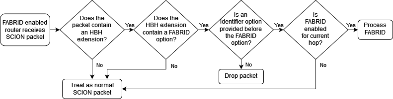

********
FABRID
********
.. _fabrid-design:

- Author: Justin Rohrer, Jelte van Bommel, Marc Odermatt, Marc Wyss, Cyrill Krähenbühl, Juan A. García-Pardo
- Last Updated: 2024-04-08
- Discussion at:

Abstract
===========

In SCION the endhosts have the option to choose *inter-AS* paths to forward packets to a destination.
However, some applications require more fine grained path selection like "Do not route traffic over devices
produced by hardware manufacturer X or that run software Y with version < Z" which requires transparency and
control also with respect to *intra-AS* paths.
Such fine-grained path selection is useful for example if there exists a known bug in certain router versions that affect secure communication,
or if an entity simply does not trust a certain hardware manufacturer, so that traffic can be steered around those devices.
This can also be seen as an enhancement for keeping traffic within a certain jurisdiction, e.g., by routing traffic
only along devices located in a specific country.

Background
===========

The `FABRID <https://netsec.ethz.ch/publications/papers/2023_usenix_fabrid.pdf>`_,
protocol allows to implement such fine-grained path selection.
A deployment of FABRID in SCIONLab makes its next-generation features available to interested parties around the globe.
FABRID also implicitly implements the `EPIC <https://netsec.ethz.ch/publications/papers/Legner_Usenix2020_EPIC.pdf>`_,
features source authentication for routers and the destination host, and path validation for source and destination hosts.

Proposal
========

FABRID indroduces policies, which can be thought of as additional path constraints such that the ASes only use intra-AS paths that fulfill that policy.
The ASes announce those policies to the end hosts, who then can use those additional path constraint during path selection.
The border routers use those policies to decide on the intra-AS path to forward, e.g. by using MPLS labels.
Some FABRID policies are globally defined and others locally per AS.
Global policies makes sense to have known policies for the common use cases where each end host knows that if an AS supports that policy,
then it knows the constraints of that policy without the need of fetching the full policy description.
The AS network operator configures which global FABRID policies are supported for the local AS and can add additional local FABRID
policies that are valid for this AS.
The FABRID policy identifiers are provided to the endhosts inside of the PCB or as an detachable PCB extension.
The FABRID policy descriptions on the other hand have to be requested from the local control service which will then either return
the cached FABRID policy description or query the policy description from the remote AS.
That way we can minimize the overhead that the FABRID polices cause to the PCB size.
A source endhost can then select a path together with FABRID policies and forward the FABRID packet over this path to a destination endhost.
The on-path border routers will then add some proof of transit such that the destination endhost can later verify that the packet indeed followed the intended path.

Our proposed design and implementation of FABRID allows for incremental deployment at router- and AS-level, i.e., some AS operators may want to
deploy FABRID while others do not, and those who do may only want to deploy it on a subset of border routers.
This allows for a smooth migration where an AS can test-wise update some border routers and test that nothing breaks.
However, this could lead to the situation where an end host does not have paths available for which all on-path ASes support FABRID.
In such a situation the end host can still send its traffic along that path, but without any of the guarantees provided by FABRID for those ASes.

Since each AS can create their own local FABRID policies, end hosts have to learn them.
In our design, end hosts have to learn them from their local AS, and the local AS has to learn them from the remote AS, similar to how SCION path retrieval is implemented.
Those policies are only fetched on demand by the local control service and will be cached till end of their validity.
This allows for better scalability for the FABRID policies because an AS does not have to learn all FABRID policies from all other ASes.
Even though the beacon had to be adapted, the size increase is negligible.

The design document specifies:

- The header design
    Specification of the two new Hop-by-Hop extension options, their fields and how they are computed.
- The data plane
    Describes how the FABRID packets are processed and forwarded at the border routers, how the endhosts can send FABRID packets,
    and the path validation for the destination endhost.
- The control plane
    Describes how the FABRID policies are defined, additional beaconing information, and new FABRID control service endpoints which are used for
    communicating the FABRID policies to the endhosts and remote ASes.
- Configuration
    Describes how the border router and the control service have to be configured such that they are able to process FABRID packets.

The design document will be extended in the future to also specify features that will be implemented in a later
iteration e.g. path validation for the source end host.

    
    Example network topology; different router colors indicate different manufacturers.
    Here we have the Hosts H01 from AS01 and Host H02 from AS02 who try to communicate with each other.
    This topology allows constraints like "Do not route traffic over devices produced by hardware manufacturer red", or
    "Route traffic only over devices produced by hardware manufacturer green or blue".
    Since all paths between Host H01 and Host H02 traverse a green router, it is not possible to find a path that does not traverse green routers.

Header design
--------------

The FABRID header design is built using the SCION Hop-by-Hop extensions (HBH), which allows for incremental deployability.
We created two different HBH options.
First, the Identifier option that contains the packet ID and a timestamp which is used to uniquely identify a packet of a flow.
And second, the FABRID option that contains the FABRID hopfield metadata fields and a path validator field.
The Identifier option can be used without the FABRID option and can therefore also be used by other extensions.
The FABRID option on the other hand requires that the Identifier option is specified in the HBH extension before the FABRID option.

.. _identifier-option:

Identifier Option
^^^^^^^^^^^^^^^^^^

The Identifier Option always has a length of 8 bytes and look like::

     0                   1                   2                   3
     0 1 2 3 4 5 6 7 8 9 0 1 2 3 4 5 6 7 8 9 0 1 2 3 4 5 6 7 8 9 0 1
                                    +-+-+-+-+-+-+-+-+-+-+-+-+-+-+-+-+
                                    |  OptType = 3  |  OptLen = 8   |
    +-+-+-+-+-+-+-+-+-+-+-+-+-+-+-+-+-+-+-+-+-+-+-+-+-+-+-+-+-+-+-+-+
    |R R R R R|                Timestamp                            |
    +-+-+-+-+-+-+-+-+-+-+-+-+-+-+-+-+-+-+-+-+-+-+-+-+-+-+-+-+-+-+-+-+
    |                          Packet ID                            |
    +-+-+-+-+-+-+-+-+-+-+-+-+-+-+-+-+-+-+-+-+-+-+-+-+-+-+-+-+-+-+-+-+

Timestamp
    The 27 bit timestamp of when the packet has been sent with 1 millisecond precision
    relative to the timestamp of the first InfoField of the SCION header.
Packet ID
    The 32 bit packet ID that is used together with the timestamp to uniquely identify
    the packet originating from a particular flow.

.. _fabrid-option:

FABRID Option
^^^^^^^^^^^^^^

The FABRID Option has a length of (#NumberOfOnPathASes + 1)*4 bytes.
This hop-by-hop option has an allignment of 4 bytes::

     0                   1                   2                   3
     0 1 2 3 4 5 6 7 8 9 0 1 2 3 4 5 6 7 8 9 0 1 2 3 4 5 6 7 8 9 0 1
                                    +-+-+-+-+-+-+-+-+-+-+-+-+-+-+-+-+
                                    |  OptType = 4  |  OptLen = ?   |
    +-+-+-+-+-+-+-+-+-+-+-+-+-+-+-+-+-+-+-+-+-+-+-+-+-+-+-+-+-+-+-+-+
    | Enc PolicyID  |F|A|   Hop Validation Field                    |
    +-+-+-+-+-+-+-+-+-+-+-+-+-+-+-+-+-+-+-+-+-+-+-+-+-+-+-+-+-+-+-+-+
    | Enc PolicyID  |F|A|   Hop Validation Field                    |
    +-+-+-+-+-+-+-+-+-+-+-+-+-+-+-+-+-+-+-+-+-+-+-+-+-+-+-+-+-+-+-+-+
    |    ....       | | |               ....                        |
    +-+-+-+-+-+-+-+-+-+-+-+-+-+-+-+-+-+-+-+-+-+-+-+-+-+-+-+-+-+-+-+-+
    | Enc PolicyID  |F|A|   Hop Validation Field                    |
    +-+-+-+-+-+-+-+-+-+-+-+-+-+-+-+-+-+-+-+-+-+-+-+-+-+-+-+-+-+-+-+-+
    |                       Path Validator                          |
    +-+-+-+-+-+-+-+-+-+-+-+-+-+-+-+-+-+-+-+-+-+-+-+-+-+-+-+-+-+-+-+-+

Encrypted PolicyID
    The 8 bit encrypted FABRID policy index.
F
    Stands for “FABRID enabled” and if this is set to false, the router responsible for
    that hop will not apply any FABRID logic to this packet.
    This can be used e.g. if an on-path AS does not support FABRID, or if the endhost does not care
    about FABRID for that AS.
A
    Stands for “AS-level key”. If this is set to true, instead of a AS-Host Key, an AS-AS DRKey will be used.
    This can be used to achieve scalability in future in-network DDoS defense solutions, see `RAINBOW`_.
    Using the AS-Host Key is the default option in FABRID.
Hop Validation Field
    22 bit Message Authentication Code to authenticate the FABRID extension metadata field.
    With this the receiving endhost can be sure that the packet has actually been processed by that AS.
Path Validator
    4 byte Path Validator. The sending endhost will compute the path validator and the
    receiving endhost can then recompute the path validator to verify that the packet
    has been sent over the correct path.

Identifier and FABRID Option combined
^^^^^^^^^^^^^^^^^^^^^^^^^^^^^^^^^^^^^^^^^^

If no other HBH extension options are present, the HBH options of a FABRID-enabled packet look like this::

     0                   1                   2                   3
     0 1 2 3 4 5 6 7 8 9 0 1 2 3 4 5 6 7 8 9 0 1 2 3 4 5 6 7 8 9 0 1
                                    +-+-+-+-+-+-+-+-+-+-+-+-+-+-+-+-+
                                    |  OptType = 3  |  OptLen = 8   |
    +-+-+-+-+-+-+-+-+-+-+-+-+-+-+-+-+-+-+-+-+-+-+-+-+-+-+-+-+-+-+-+-+
    |R R R R R|                Timestamp                            |
    +-+-+-+-+-+-+-+-+-+-+-+-+-+-+-+-+-+-+-+-+-+-+-+-+-+-+-+-+-+-+-+-+
    |                          Packet ID                            |
    +-+-+-+-+-+-+-+-+-+-+-+-+-+-+-+-+-+-+-+-+-+-+-+-+-+-+-+-+-+-+-+-+
    |   Padding     |    Padding    |  OptType = 4  |  OptLen = ?   |
    +-+-+-+-+-+-+-+-+-+-+-+-+-+-+-+-+-+-+-+-+-+-+-+-+-+-+-+-+-+-+-+-+
    | Enc PolicyID  |F|A|   Hop Validation Field                    |
    +-+-+-+-+-+-+-+-+-+-+-+-+-+-+-+-+-+-+-+-+-+-+-+-+-+-+-+-+-+-+-+-+
    | Enc PolicyID  |F|A|   Hop Validation Field                    |
    +-+-+-+-+-+-+-+-+-+-+-+-+-+-+-+-+-+-+-+-+-+-+-+-+-+-+-+-+-+-+-+-+
    |    ....       | | |               ....                        |
    +-+-+-+-+-+-+-+-+-+-+-+-+-+-+-+-+-+-+-+-+-+-+-+-+-+-+-+-+-+-+-+-+
    | Enc PolicyID  |F|A|   Hop Validation Field                    |
    +-+-+-+-+-+-+-+-+-+-+-+-+-+-+-+-+-+-+-+-+-+-+-+-+-+-+-+-+-+-+-+-+
    |                       Path Validator                          |
    +-+-+-+-+-+-+-+-+-+-+-+-+-+-+-+-+-+-+-+-+-+-+-+-+-+-+-+-+-+-+-+-+

.. _fabrid-formulas:

Header fields computation
^^^^^^^^^^^^^^^^^^^^^^^^^^

.. math::
    \begin{align*}
        &\text{encryptedPolicyID = policyID} \oplus \text{AES.Encrypt(}K_i\text{, Identifier)[0]}\\\\
        &\text{policyID = encryptedPolicyID} \oplus \text{AES.Encrypt(}K_i\text{, Identifier)[0]}\\\\
        &K_i \text{ = DRKey (AS A}_i \rightarrow \text{AS}_0\text{:Endhost) or DRKey (AS A}_i \rightarrow \text{AS}_0)\\\\
        &\text{HVF}_i = \text{MAC}_{K_i}\text{(Identifier, ingress}_i\text{, egress}_i\text{, encryptedPolicyID}_i, \\& \text{srcAddrLen, srcHostAddr)[0:3] } \& \text{ 0x3FFFFF}\\\\
        &\text{HVFVerified}_i = \text{MAC}_{K_i}\text{(Identifier, ingress}_i\text{, egress}_i\text{, encryptedPolicyID}_i, \\& \text{srcAddrLen, srcHostAddr)[3:6] } \& \text{ 0x3FFFFF}\\\\
    \end{align*}

For accessing a sub slice we use the [a:b] notation, where we take the bytes from index a to index b, where b is exclusive.
For the DRKey notation, see :doc:`/cryptography/drkey`.

Data plane
----------

Processing at the router
^^^^^^^^^^^^^^^^^^^^^^^^^^

Whenever a FABRID enabled router receives a SCION packet, it has to figure out whether it should be processed as FABRID or not.
If an AS receives a FABRID packet but does not support FABRID, it treats the packet as a normal SCION packet.
In both cases, all the logic of a normal SCION packet will be applied too.
The router determines whether the SCION packet is a FABRID packet as follows:

If the router supports FABRID and the SCION packet contains the FABRID HBH extension, the router is going to verify the
correctness of the current FABRID Hop-validation-field using either the AS-to-AS or AS-to-Host DRKey and verifies whether
the encrypted policy index matches a valid FABRID policy.
If this is the case, the router will update the FABRID HVF to HVFVerified, see the :ref:`Header fields computation <fabrid-formulas>`,
and route the packet over an intra-AS path matching the provided FABRID policy.
All intra-AS paths are configured by the AS operator, and are provided to the border routers by the local control service.

Processing at the endhost
^^^^^^^^^^^^^^^^^^^^^^^^^^

To be able to send a FABRID packet, the endhost has to choose a path that supports its path constraints.
With this the endhost is able to create FABRID packets and then send them to the border router for further forwarding.
The FABRID snet implementation will automatically request the necessary DRKeys and compute the hop validation fields,
the endhost only has to provide the path and the FABRID policies.
Then the receiving endhost can recompute the path validator to verify that the packet was forwarded over this path.

Control plane
---------------

Control service
^^^^^^^^^^^^^^^^^

The control service for FABRID is responsible for maintaining the by the AS-operator configured FABRID policies, intra-AS paths,
and making them accessible for the routers, the endhosts and other remote control services.
The policies are defined between interface pairs and for the last AS on the path also per interface - IP range pair.
Through gRPC, border routers can query the control service for the list of supported policies,
as well as the mapping from policies to MPLS labels.
Policies are disseminated to remote ASes through PCBs, which clients in the AS can query from their Path Servers.
This policy information can also be requested directly from remote ASes over gRPC.

The control service introduces a FABRID service with the following endpoints where intra-AS means it can be reached
from the local AS and inter-AS means it can be reached from a remote AS:

- GetMPLSMapIfNecessary (intra-AS)
    Is used by the router to retrieve the MPLS map for the intra-AS paths.
    The map is only returned if the router does not have an up to date MPLS map.
- GetRemotePolicyDescription (intra-AS)
    Is used by the endhosts of the local AS to request the policy description of a policy identifier for a remote AS.
- GetSupportedIndicesMap (inter-AS, intra-AS)
    Returns the per interface-pair supported FABRID indices.
- GetIndexIdentifierMap (inter-AS, intra-AS)
    Returns a map that maps identifiers to indicies which can then be used for sending FABRID packets.
- GetLocalPolicyDescription (inter-AS, intra-AS)
    Is used to request the policy description of a policy identifier for the local AS.

Important data structures
^^^^^^^^^^^^^^^^^^^^^^^^^^^

The following list explains the most important data structures used in the FABRID service:

- SupportedIndicesMap
    Maps a connection pair consisting of two ConnectionPoints (Type: string, IP: string, Prefix: uint32, InterfaceId: uint16)
    to a list of policy indices.
    This map shows for each connection pair which policy indices are supported, which can be one or multiple policies.
    A ConnectionPoint is either an interface, an IP range or wildcard.
    For all intermediary hops interface to interface connection points will be used whereas interface to IP range is used for the last hop.
- IndexIdentifierMap
    A policy index is to be embedded in the HBH extension and therefore has to be minimal in size.
    The size of a policy index is 8 bits, whereas identifiers can be a multiple of this (especially global identifiers).
    The policy index is thus different to the policy identifier. In order to decode which policies are supported on which interfaces,
    a mapping is required from policy index to local and global identifiers.
    This mapping is provided by this map.
- IdentifierDescriptionMap
    Global identifiers can be found in a global datastore, but local identifiers are specific to an AS.
    This map maps a local policy identifier to its corresponding description.
- MPLSMaps
    Routers need to be aware of the supported policy indices and the corresponding MPLS config they need to apply to packets to
    enforce the policy in the internal network.
    Routers periodically fetch this map from the control service.
    A hash of the MPLS map is maintained, such that routers only have to update if their hash differs from the one at the control service.
- RemotePolicyCache
    When a local policy is queried at a remote AS, the resulting policy description is cached at the requesting AS' FABRID Manager,
    such that subsequent requests can be served from cache.

PCB dissemination
^^^^^^^^^^^^^^^^^^^^^^^

The IndexIdentifierMap and SupportedIndicesMap are included in a (unsigned) detachable extension in the PCBs for an AS.
Hashes of these maps are maintained in a Signed AS Entry, such that the authenticity of these maps can be verified.
The detachable extension can also be present in the PCB, i.e. it does not have to be detached in all cases, e.g. if there are only very few policies.
If the maps are detached, they can be fetched from the control service of that AS and the received maps can be verified with the hashes.
To ensure a consistent hash calculation, the key entries of these maps have to be sorted, such that they are accessed in a consistent order.

Exposing policies to the end hosts
^^^^^^^^^^^^^^^^^^^^^^^^^^^^^^^^^^^^^

The path combinator finds the most recent FABRID map per AS among the received segments and subsequently uses this map to find the FABRID
policies that are available for each interface pair of hops.
This results in a set of PolicyIdentifiers per hop, which can then be used by the application, such as with the usage of a
specific 'sequence' parameter which incorporates the policies.
Once the application has decided which policies to use, it can craft a FABRID HBH extension and include this as an option when sending
the packet.

DRKey
^^^^^^

FABRID uses DRKey for computing the Encrypted Policy Indices, the FABRID Hop Validation Fields and the Path Validator.
The routers use the fast key derivation side, whereas the endhosts will use the slow side.

Configuration
--------------

Control service
^^^^^^^^^^^^^^^^^^

To be able to use DRKey, one has to configure the control service setting "drkey.level1_db" and "drkey.secret_value_db".
Additionally, since the border routers will fetch the secret value from the control service, the control service also has to
add the internal IP address of all border routers of the local AS to the DRKey delegation list for FABRID.

This could look like this::

    [drkey.level1_db]
    connection = "gen-cache/cs1-ff00_0_110-1.drkey-level1.db"

    [drkey.secret_value_db]
    connection = "gen-cache/cs1-ff00_0_110-1.drkey-secret.db"

    [drkey.delegation]
    FABRID = [ "fd00:f00d:cafe::7f00:11", "fd00:f00d:cafe::7f00:12", "fd00:f00d:cafe::7f00:13"]

The FABRID policies are configured in the control service.

Border router
^^^^^^^^^^^^^^^

For a router to query the DRKey secret value from the control service, once has to enable this.

This could look like this::

    [router]
    use_drkey = true

Considerations for future work
--------------------------------

SCMP response
^^^^^^^^^^^^^^^

With the current implementation, the sending endhost is not being informed when his packet gets dropped due to a FABRID error.
In the future the border routers we might think about whether to enable routers to send an SCMP response if they encounter
an error when processing FABRID which might help the sending endhost in figuring out why his packet does not arrive at its destination.
However, we have to be careful to not introduce additional attack vectors, e.g. for volumetric denial-of-service or reflection attacks.

EPIC-HP as extension with Identifier option
^^^^^^^^^^^^^^^^^^^^^^^^^^^^^^^^^^^^^^^^^^^^^^

We could create a new HBH extension for EPIC hidden-path, which uses the Identifier option, instead of the
current design which uses a SCION path-type.
This allows the use of EPIC HP also in a incremental deployment like we have with FABRID.
And additionally, we could also use FABRID together with EPIC HP.

.. _RAINBOW:

The RAINBOW system
^^^^^^^^^^^^^^^^^^^^^

The RAINBOW system is a future extension of FABRID, which allows marking traffic as higher quality of service, to be
prioritized at on-path BRs.
Specifically, each BR reserves a certain amount of bandwidth for RAINBOW traffic, which is divided evenly between different source ASes.
As this division happens on the level of ASes and not individual endhosts, the BR also needs to be able to authenticate traffic at an AS level.
The FABRID HBH extension makes this possible, by including an "AS level key" flag, which specifies that the original HVF has been authenticated
again by an AS-AS DRKey, that is only known to trusted infrastructure in the source AS.

Rationale
==========

Path type vs HBH extension
--------------------------------

FABRID can be implemented either as a HBH extension or a path type.
The reason why we decided against a path type is that FABRID as a HBH extension is incrementally deployable, whereas
a new path type is not.
The drawback of this solution is that for the FABRID HBH extension, the Identifier HBH extension, and the HBH extension
header itself, we need in total 8 additional bytes compared to a design that uses a path-type.

Separate Identifier option
---------------------------

Instead of just having a single FABRID HBH option, we decided to move the packet ID and packet timestamp to another HBH option,
the so called Identifier option, because this might also be useful for other HBH extensions and not just for FABRID
(e.g., it would allow to port EPIC-HP from a path type to a HBH extension).
Since FABRID still requires the packetID and packet timestamp, providing the Identifier option became mandatory for FABRID packets.
The cost of moving the Identifier to a separate HBH extension is 4 bytes, where 2 bytes are used for the HBH option type and length
fields and 2 bytes for padding to have the FABRID HBH extension 4 bytes alligned.

Length of PacketID and PacketTimestamp for the Identifier HBH option
---------------------------------------------------------------------

The Identifier has a timestamp with a length of 27 bits, which encodes the relative time in milliseconds after
the timestamp value of the first InfoField of the SCION header.
The 27 bit allow to save relative timestamps with a difference of up to 37 hours which fulfills the requirement
that a path can be valid for up to 24 hours.

Length of FABRID policyID and how to determinte whether policy is local or global
----------------------------------------------------------------------------------

The decision on whether a certain FABRID policy is a local or global policy is done by the control service,
hence we do not have to reserve any bits of the FABRID policy index in the FABRID packets to encode whether
it is a local or global policy.
In the header design the FABRID policyIndex has a length of 1 byte, which allows 256 different options.
But since the control service can configure the policies per interface pair and / or per IP range, there
are many more options than the 256.

Compatibility
===============

FABRID is a new extension which uses the SCION Hop-by-Hop extension which allows
for incremental deployment of FABRID.
If a border router does not understand the FABRID Hop-by-Hop extension
it will simply ignore it and hence not provide any of the FABRID functionality and forward the packet as if it
is a normal SCION packet.
The "FABRID enabled" flag allows the sending endhost to choose for which ASes to enable path validation,
but is also specifically required, for edge-cases where an AS just starts to roll out FABRID functionality to its
border routers, but the sender does not yet know that this AS is FABRID aware.
Because if a packet does not contain a HVF for this AS, the packet has to be dropped unless the sender can explicitly
state that FABRID is disabled for this hop.

Implementation
================

We plan to provide the implementation in the following steps (PRs):

- Support in the border router to set MPLS labels to outgoing packets

- The basic FABRID implementation as described in this design document

- Full FABRID with path validation also at source

- FABRID Intra-AS emulation for SCIONLab